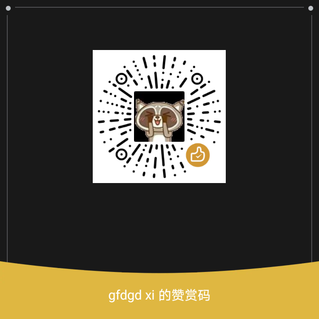

<p width=100px align="center"></p>
<h1 align="center">GXDE 内核管理器 1.1.1</h1>
<hr>
<a href='https://gitee.com/GXDE-OS/gxde-kernel-manager/stargazers'></img></a>
<a href='https://gitee.com/GXDE-OS/gxde-kernel-manager/members'></img></a>  

## 国产的 arm CPU（如飞腾、鲲鹏、麒麟） 不要随意更换内核，否则会因为更换内核导致兼容性问题甚至无法启动

## 介绍
GXDE 内核管理器是一个帮助用户更方便获取、安装、移除内核的工具。  
目前支持 amd64、arm64、mips64 和 loong64 四个架构  
***警告：请不要随意操作内核除非你知道你在做什么！***  
QQ 群：881201853  

GXDE Kernel Manager is a kernel manager allows users to install or remove kernels easily.  
Support architectures: amd64, arm64, mips64, loong64  
**Warning: You may damage your system unless you know what you will do!**  


## GXDE 系统如何安装 GXDE 内核管理器？
只适用于 GXDE，deepin/UOS 等需要下载 deb 手动安装  
```bash
sudo apt update
sudo apt install gxde-kernel-manager
```

## 更新内容
### 1.1.1（2024.06.29）
**※1、新增内核详细信息窗口**  
**※2、修复在部分机器上安装内核直接提示错误 1 的问题**  

**※1. Add an information window about the Kernel**  
**※2. Fix the issue with the installed Kernel causing exit code 1**  

### 1.1.0（2024.05.12）
**※1、支持从 apt 源读取内核数据并显示安装**  
**※2、支持只显示与当前系统相同架构的内核**  
**※3、下载/更新内核时支持调用 aptss 提升下载速度**  
**※4、新增卸载所有内核时的窗口警告**  
5、优化表格显示效果  
6、支持显示内核描述和版本  

**※1. Support getting kernel data from apt database.**  
**※2. Support showing only kernels that are the same as the local system architecture.**  
**※3. Support using aptss to download packages faster.**  
**※4. Show a warning message box when removing all kernels.**  
5. Optimize the effect of the kernels table.  
6. Support showing kernel descriptions and versions.  


### 1.0.1（2024.05.03）
**1、修复部分系统无法打开管理器的问题**  
**2、新增 Sourceforge 源以准备支持大内核文件**  

### 1.0.0（2024.05.02）

  
  
  
  

## 内核仓库 apt 源
安装 GXDE 内核管理器后会自动添加  
源地址：https://kernel.gxde.gfdgdxi.top/  

## 编译安装
```bash
git clone https://gitee.com/GXDE-OS/gxde-kernel-manager
cd gxde-kernel-manager
sudo apt build-dep .
qmake .
make -j4
sudo make install -j4
```
## 构建 deb 包
```bash
git clone https://gitee.com/GXDE-OS/gxde-kernel-manager
cd gxde-kernel-manager
sudo apt build-dep .
sudo apt install fakeroot
dpkg-buildpackage -b -us
```
## 请作者喝杯茶
如果您觉得 Wine 运行器对你有帮助，可以请作者喝杯茶  
 


### 广告
支付宝官方活动，扫描获得支付红包！  
<p></p>

# ©2023～Now gfdgd xi